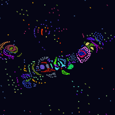

# What's New?

With v1.2.2, the particle count has been slightly reduced to 24,000 to address performance issues.

# 🧬 Primordis

- A digital emergence simulator where structure, motion, and proto-life arise from raw physics.

Primordis is a GPU-accelerated particle-based simulation where life-like behaviors—swimmers, caterpillars, and **multicellular organisms**—emerge from nothing but local interaction.

There are no hardcoded cells.  
No genetic logic.  
Just particles, forces, memory... and time.

---

## 🌌 What Happens Inside

- 💠 Particles of 32 types interact via attractive/repulsive force matrices
- 🔁 Local recursive loops form **stable arrangements**
- 🐛 Some clusters begin to move as **swimmers** and **caterpillars**
- 🧬 Eventually, collections of swimmers **cohere** into **multicellular structures** - Organized, persistent, and adaptive.

These aren't designed organisms.  
They **emerge**, evolve, and stabilize on their own.

---

## 🔥 The Edge of Complexity

> **K = 96**, **Particle Drift Strength = 0.25**, **Particle Types = 32**, **Max Radius = 64**  
> Known as the **Primordis Edge** - the zone where the most **sophisticated emergent structures** arise.

At this edge, you'll observe:
- Coordinated movement
- Cooperative behavior between agents
- **Formation of multicellular bodies** that **retain identity** across time

---

## 📷 Screenshots (More can be found in the Atlas)

---

## 🛠 Getting Started

1. Install Pygame, Moderngl and Numpy
'pip install pygame moderngl numpy'

2. Right click and run with Python. If this doesn't work, use the terminal, and navigate to the Primordis directory with 'cd (file location)' followed by 'python Primordis.py'
